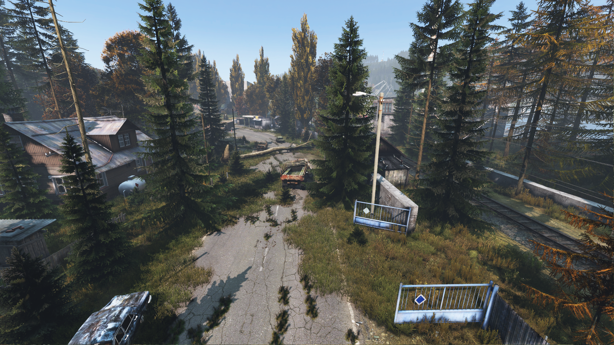
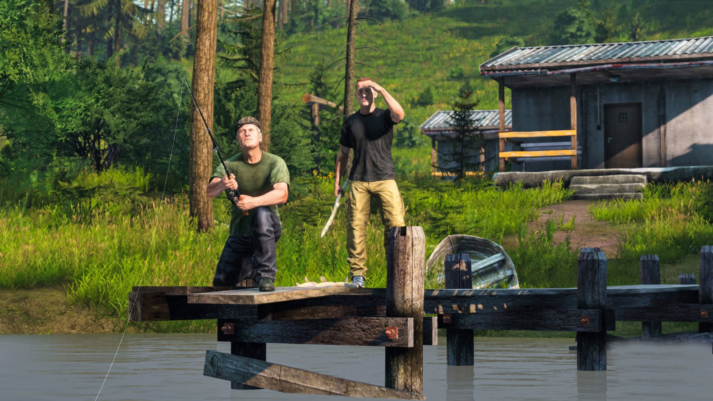
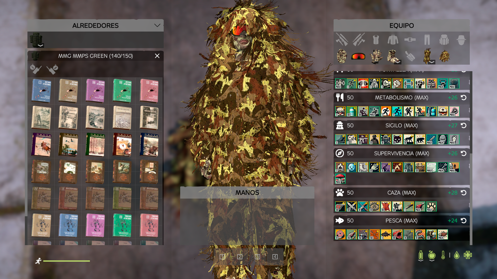
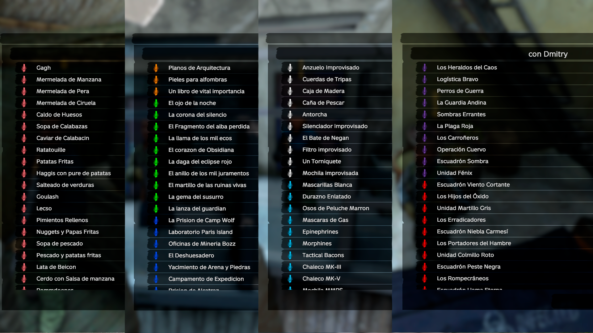
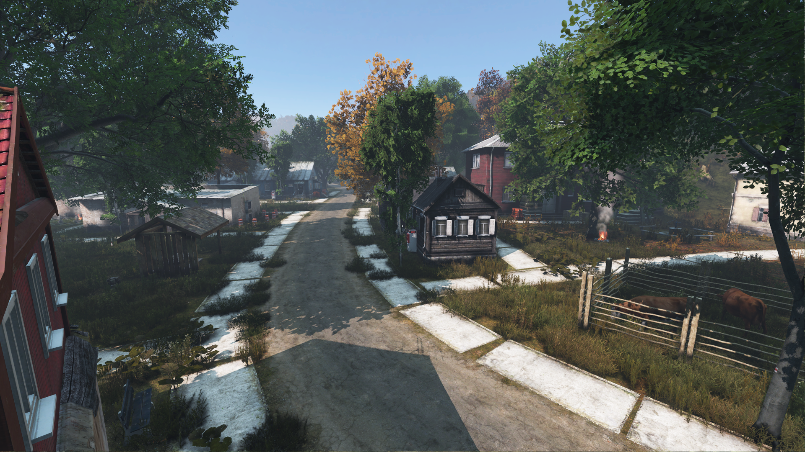
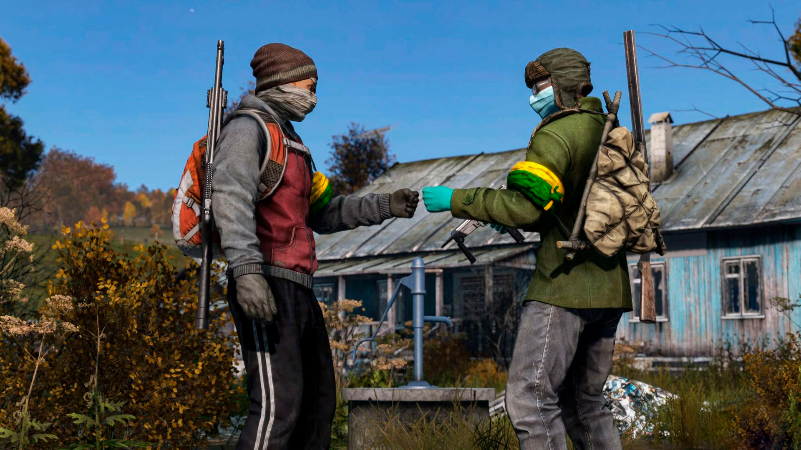

# 👋 Bienvenida

***

<figure><figcaption></figcaption></figure>

## Instrucciones Generales


Aqui podras encontrar todo referente a nuestro reglamento y tambien una guia detallada de todas las dinamicas que te ofrecemos en "Bozz | Zona Latina", recuerda tomarte un momento para leer estos apartados con calma y evitarte sanciones futuras que arruinen tu estadia.


***



### Bozz | Zona Latina

En nuestra comunidad, te ofrecemos una estadia basada en el respeto mutuo, los administradores y todo el staff esta para supervisar que eso se cumpla bajo toda circunstancia... Disfruta de todo lo que podemos ofrecerte, partiendo de un farmeo de mecanicas diversas, como tambien misiones,eventos todos los fines de semana, sorteos, subastas y mucho mas.



### Administradores

Los administradores estan para disolver tus dudas, atender tus quejas y resolver tus inconvenientes siempre y cuando estos sean por algun BUG del dayz como tal, no esperes que un administrador te ayude a desvolcar un vehiculo, llegar mas rapido a tu cuerpo o regalarte objetos, evita abusar de la confianza.



### Sistema de Tickets

En la parte inferior del discord te encontraras con nuestro sistema de tickets, eh este canal podras seleccionar la opcion que desees y un miembro del staff te atendera a la brevedad posible... Recuerda que si presentaras alguna queja o reclamo siempre es necesario adjuntar pruebas para ayudarnos a tomar una decision mas rapida y efectiva.



### Objetivo de Temporada

Tenemos la fiel mision de mejorar constantemente temporada tras temporada, por ello nuestro reglamento esta sujeto a cambios y modificaciones cada que lo consideremos necesario para mejorar la experiencia y hacer de la jugabilidad "una mas justa para todos", recuerda siempre consultar si algo no logras comprender, antes de realizar acciones que puedan ir en contra de nuestras reglas o que puedan considerarse como vacios legales.



***

## Inmersion en Chernarus


Esta temporada no queremos ofrecerte mas de lo que ya todos ofrecen, esta temporada sera especial y tendra una inmersion unica y de calidad asi que preparate para disfrutar al maximo esta experiencia y recuerda siempre estar alerta porque aqui no solo te enfrentas a jugadores.


***

### Post-apocalipsis

Chernarus ya no es lo que antes era, ahora la vegetacion se apodera de las calles, ciudades y la infeccion a contagiado todos los rincones de estas bastas tierras. Tu y otros supervivientes estan aqui para sobrevivir y comerciar o enfrentarse en diversas batallas de ser necesario, los otros supervivientes no son tu unica preocupacion. La gasolina es escasa y cada nuevo amanecer deberas ir por ella antes que los saqueadores, aunque no todo es malo, aun queda algo de fauna silvestre que podra servirte para sobrevivir otro dia.

<figure><figcaption></figcaption></figure>

### Mutaciones

Como mencionaba antes, otros supervivientes no son tu unica preocupacion, en este apocalipsis se desataron acciones atroces e irreversibles con las cuales te tocara lidiar hasta el fin de tus dias, algunos de estos seres mutantes estan detallados en los registros de BOZZ, pero otros aun no han sido descubiertos y la verdad es que nadie desea hacerlo... Lo poco que conocemos ya es macabro, no queremos imaginar lo que pueda haber mas alla de nuestras investigaciones.

<figure><figcaption></figcaption></figure>

### Farmeo

Te tocara farmear lo tuyo si es que el dinero no te alcanza para comprar alimentos, aunque tambien puedes farmear para vender, lo cual seria rentable siendote honesto... Aqui podras cosechar vegetales para luego convertirlos en exquisitos platillos que podras ingerir o negociar con otros jugadores y comerciantes. Te encontraras con un sistema de pesca muy diverso en el cual podras pescar, comer o vender desde camarones hasta tiburones. No todo el farmeo es legal, pero lo ilegal te tocara descubrirlo por tu cuenta.

<figure><figcaption></figcaption></figure>

### Habilidades

Una vez dentro y listo para esta gran aventura, te encontraras con un sistema de habilidades el cual te ofrecera 7 diferentes ramas que tendras que mejorar progresivamente, cada rama te ofrece diferentes ventajas y a medida que las vas mejorando, las recompensas que te ofrece seran vitales para tu supervivencia, ten en cuenta tambien que cada que tu personaje muere perdera un porcentaje de esta experiencia ganada, asi que procura tener eso siempre en cuenta, al pasar el cursor por encima de los titulos o los recuadros pequeños obtendras toda la informacion relevante.

<figure><figcaption></figcaption></figure>

### Misiones

Aqui no todo se centra en matar y sobrevivir, tambien contamos con un sistema de misiones el cual podras realizar para ganar algo de dinero extra o simplemente para adentrarte en nuevos retos llenos de suspenso, estas misiones pueden ir desde largos viajes, busqueda de tesoros, crafteo de items, hasta enfrentamientos contra campamentos de mercenarios. Procura ir con cautela, algunas misiones solo podran realizarse 1 vez por semana. Adicional a ello tienes las misiones del "BOZZ PASS" el cual es nuestro sistema de recompensas mensuales, aqui simplemente haces las misiones y cuando creas necesario y oportuno reclamas tus recompensas, asi de simple.

<figure><figcaption></figcaption></figure>

### IAs y NPCs de Entorno

Desde que despiertas tu preocupacion no solo es lo que ya conoces, sino tambien quienes se esconden entre los arbustos y las sombras, aqui te encontraras con un sistema de IAs dinamico, el cual actuara y realizara sus actividades aunque no sean contra ti, esto implica que hayan enfrentamientos entre grupos de IAs distintos o que 2 grupos similares se encuentren y decidan unirse, por lo consiguiente procura ir con cuidado y atacar sin aviso a quien logres encontrarte con las siguientes descripciones, recuerda estar siempre seguro, ya que si estas en zona pve y disparas a un jugador real el daño sera reflejado hacia ti.

<figure><figcaption></figcaption></figure>

### Sistema de Tradeo

Te presentamos nuestro Trader General, esta es una zona segura en donde podras comerciar con otros jugadores o NPCs sin preocupaciones pero nunca esta demas recordarte que hay jugadores tontos, asi que siempre cuida lo tuyo... aqui podras comerciar casi de todo, desde accesorios, prendas, armas y todo lo relacionado a la pesca. tambien podras comprar y vender vehiculos, asi como tambien te encontraras aqui los vehiculos semanales que solemos añadir semana tras semana. Cuando decimos que aqui podras comerciar casi de todo es porque hay otros puntos de comercio como el trader de cazeria, el trader de helis y el black market, siendo este ultimo en donde encontraras lo mejor de lo mejor.

<figure><figcaption></figcaption></figure>

### Juegos y Mecanicas

Finalmente cerramos este apartado haciendo mencion a nuestras maneras de ganar dinero extra y obtener beneficios por actividad aunque no estes conectado, permitenos explicarte... En discord encontraras un apartado llamado "JUEGOS", es aqui donde podras reclamar "Bozz Coins" cada x tiempo, esos coins podras apostarlos en ese mismo canal en juego de azar como, dados, la carta mas alta, piedra papel y tijera o adivina el numero, asi puedes multiplicar los coins si gustas o en todo caso siemplemente reclamalos cada x tiempo. _(los comandos los encontraras ahi mismo en el canal),_ por otro lado ingame tenemos un sistema de casino, en el cual podras igualmente apostar con fichas y luego cambiarlas por items especiales tambien. Las cosas que podras comprar con los Bozz coins o con las fihas de casino las encontraras en el canal de "COMERCIO".

<figure><figcaption></figcaption></figure>
