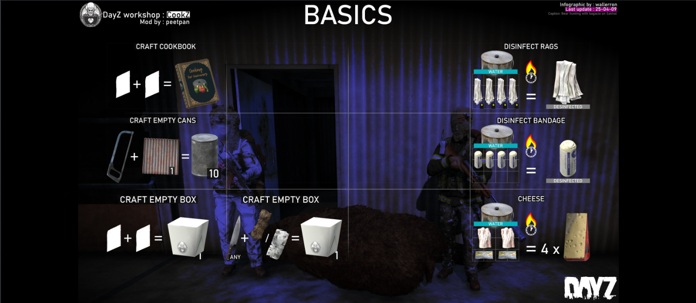

# 🍟 Alimentos


Usa esta guia y cualquier otra duda que tengas, hazla llegar a un admin para agregar nueva info.


A continuacion te mostramos el estado en el que te deben aparecer los implementos cuando una receta este lista para ser cocinada, se marcaran los bordes con color verde, por el contrario si no esta lista, no habrán bordes. te recordamos que para que un item sea util para la cocina debe tener mas de 50% de utilidad, ejemplo: un tomate al que le metiste una mordida y ahora esta al 20% no te servira, solo puede servirte para cocinarlo si tiene como minimo el 50%, y asi sera con cualquier item que desees cocinar.

<figure><figcaption></figcaption></figure>

Estas recetas aplican para los utensilios que se usaran para guardar o empaquetar los alimentos preparados, como ves en la imagen, aunque tambien te da recetas extras como los trapos o bendas desinfectadas las cuales te serviran para curar heridas mas rapido.

Tambien podras craftear el libro el cual te indicara lo mismo que estamos adjuntandote en la parte inferior (recetas y metodos de crafteo).

<figure><figcaption></figcaption></figure>

A partir de ahora te mostraremos las recetas que puedes realizar y los implementos que usaras para crear esos platillos deliciosos, algunas seran en cajas otras en latas y finalmente de adjuntamos el apartado de embutidos.

<figure><figcaption></figcaption></figure>

<figure><figcaption></figcaption></figure>

<figure><figcaption></figcaption></figure>

<figure><figcaption></figcaption></figure>

<figure><figcaption></figcaption></figure>

<figure><figcaption></figcaption></figure>

Si a pesar de haber leido y visto el material adjunto aun asi requieres ayuda para entender como funciona, solicita la ayuda de un admin para terminar de comprender el funcionamiento.
