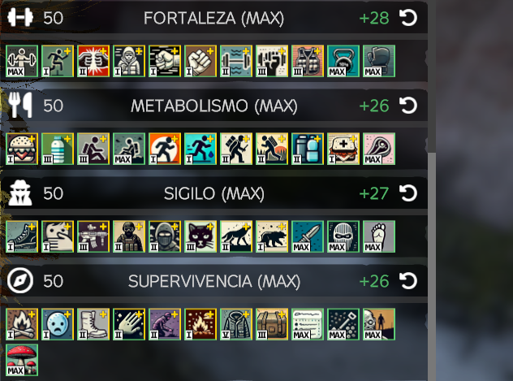

# 🔰 Habilidades


Usa esta guia y cualquier otra duda que tengas, hazla llegar a un admin para agregar nueva info.


#### Primero

Al abrir tu inventario en la parte baja del mismo te encontraras con todo lo que se muestra en pantalla y mas, todo esto es el sistema de habilidades, puedes ganar puntos realizando acciones especificas para luego asignar esos puntos en la sub-habilidad que tu quieras. Ejemplo: La habilidad es FORTALEZA, pero debajo tiene 11 sub-habilidades que puedes mejorar.&#x20;

<figure><figcaption></figcaption></figure>

#### Segundo

Una vez sabes lo que es, si pasas el cursor o raton por encima de los titulos: "FORTALEZA, METABOLISMO, SIGILO, ETC" te dejara ver la informacion relevante a esa habilidad y tambien te dira como ganar puntos. Ejemplo: METABOLISMO dice que para ganar puntos debes ingerir alimentos y beber agua.

<figure><figcaption></figcaption></figure>

#### Tercero

Si ahora pasas el cursor o raton por encima de las sub-categorias como hiciste con los titulos, te dejara ver la informacion especifica de cada sub-habilidad y lo que te ofrece. Ejemplo: La sub-habilidad de MAESTRO DE LA PROTECCION te permite aguantar golpes de manera efectiva y reduce el daño al 15%.

<figure><figcaption></figcaption></figure>
