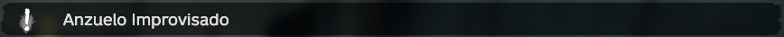
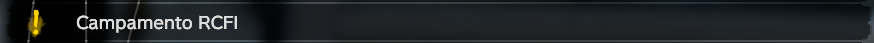
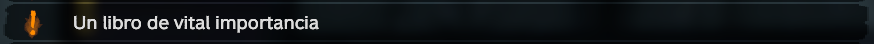
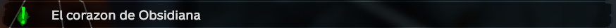
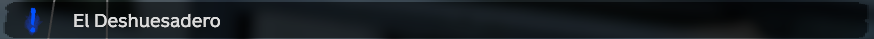
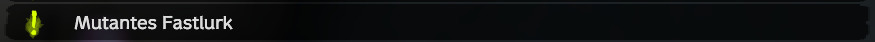
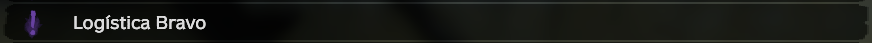
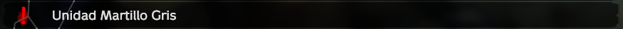
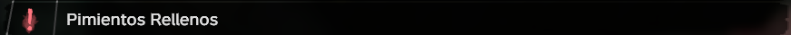

# 🪬 Misiones


Usa esta guia y cualquier otra duda que tengas, hazla llegar a un admin para agregar nueva info.


#### Fabricación

Estas misiones se centran en la fabricacion o el crafteo de diversos objetos o herramientas.

<figure><figcaption></figcaption></figure>

#### Recolección

Estas misiones se centran en encontrar o recolectar una cierta cantidad de objetos.

<figure><figcaption></figcaption></figure>

#### Exploración

Estas misiones se centran en realizar viajes de exploracion a ubicaciones designadas.

<figure><figcaption></figcaption></figure>

#### Entrega

Estas misiones se centran en coger y  entregar objetos a puntos y  lugares especifico.&#x20;

<figure><figcaption></figcaption></figure>

#### Busqueda del Tesoro

Estas misiones se centran en encontrar una ubicación que contenga un tesoro escondido.

<figure><figcaption></figcaption></figure>

#### Escota de IA

Estas misiones se centran en proteger y escoltar a una IA a una ubicación específica.

<figure><figcaption></figcaption></figure>

#### Objetivos

Estas misiones se centran en eliminar una cierta cantidad de enemigos o tambien aplica para jugadores.

<figure><figcaption></figcaption></figure>

#### Patrullas de IA

Estas misiones se centran en eliminar un grupo de IAs establecidad en algun punto del mapa.

<figure><figcaption></figcaption></figure>

#### Campamento de IAs

Estas misiones se centran en eliminar un campamento de IAs en algun punto del mapa.

<figure><figcaption></figcaption></figure>

#### Preparacion de Alimentos

Estas misiones se centran en cocinar x alimentos para crear diversos platillos.

<figure><figcaption></figcaption></figure>

