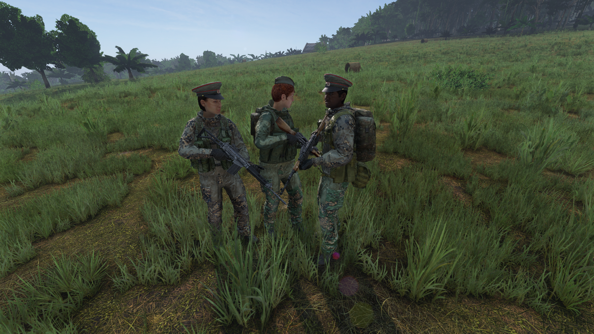
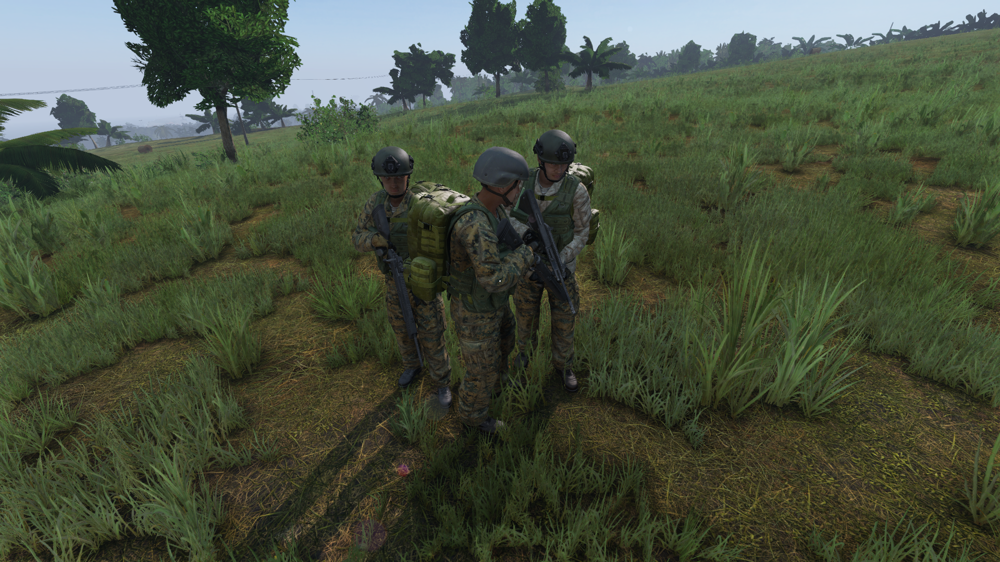
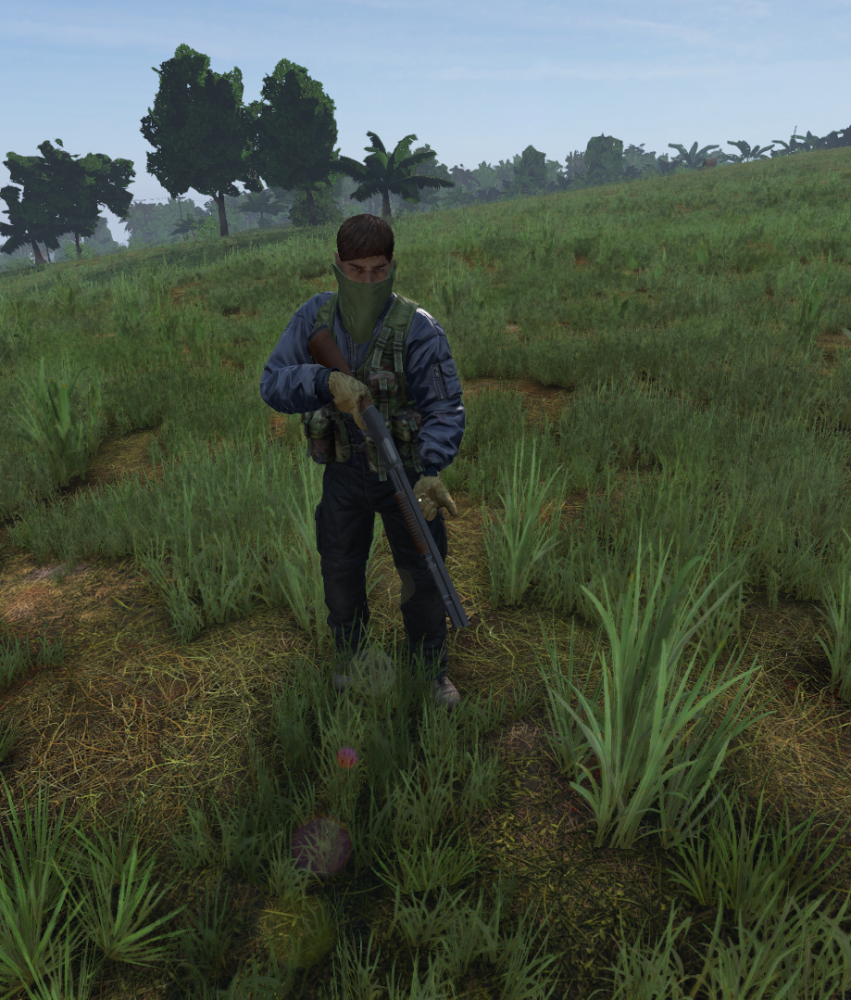
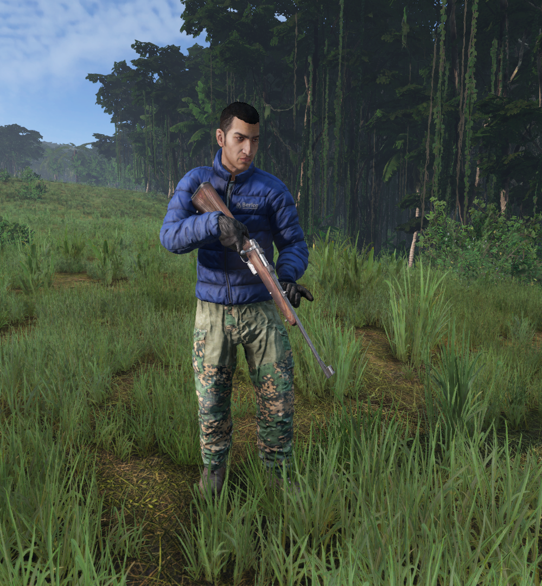
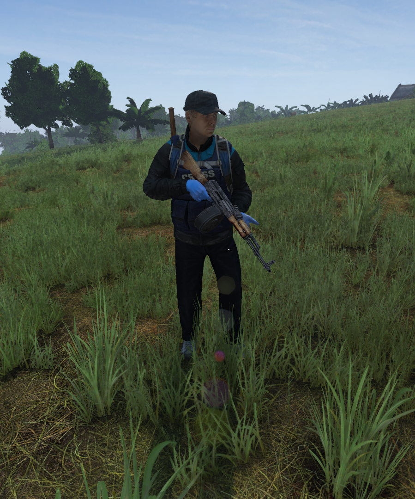

# 🔫 Npcs


Usa esta guia y cualquier otra duda que tengas, hazla llegar a un admin para agregar nueva info.


#### **Mercenarios**

Siempre usan la misma ropa, suelen ubicarse cerca de lugares con mucha interacción y zonas militares, tienen excelente puntería y andan en grupos de 2 a 3 y no son amistoso.

<figure><figcaption></figcaption></figure>

#### **Militares West**

Suelen encontrarse **al Oeste** del mapa, igual que los mercenarios andan en grupos de 2 a 3, tienen buena puntería y no son amistosos.

<figure><figcaption></figcaption></figure>

#### **Militares East**

Suelen encontrarse **al Este** del mapa, igual que los mercenarios andan en grupos de 2 a 3, tienen buena puntería y no son amistosos.

<figure><figcaption></figcaption></figure>

#### **Shamanes**

Suelen ser **rebeldes retirados del ejercito**, que andan por su cuenta, suelen estar en grupos de 2 a 3 igualmente y aparecen con los **helicrashes** muchas veces.

<figure><figcaption></figcaption></figure>

#### **Los Raiders, Civiles y Lunáticos**

Suelen ser **Npcs IA**, que pueden aparecer en las ciudades o bosques, igualmente son agresivos y no permiten contacto con otros jugadores, estos **suelen tener mucho menos puntería**.

<figure><figcaption></figcaption></figure> <figure><figcaption></figcaption></figure> <figure><figcaption></figcaption></figure>

